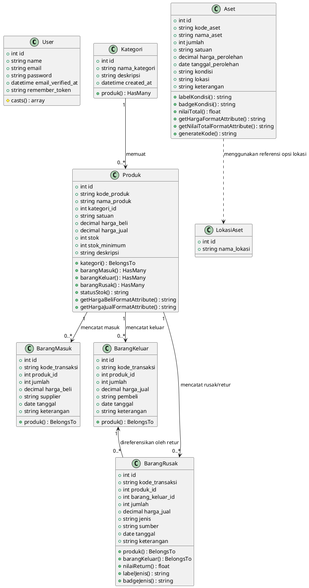

# Class Diagram: Toko Bu Nardi

Berikut adalah Class Diagram untuk model-model utama pada aplikasi Toko Bu Nardi (TBN) yang menunjukkan atribut, metode, serta hubungan relasi antar entitas.

```mermaid
classDiagram
    class User {
        +int id
        +string name
        +string email
        +string password
        +datetime email_verified_at
        +string remember_token
        #casts() array
    }

    class Kategori {
        +int id
        +string nama_kategori
        +string deskripsi
        +datetime created_at
        +produk() HasMany
    }

    class Produk {
        +int id
        +string kode_produk
        +string nama_produk
        +int kategori_id
        +string satuan
        +decimal harga_beli
        +decimal harga_jual
        +int stok
        +int stok_minimum
        +string deskripsi
        +kategori() BelongsTo
        +barangMasuk() HasMany
        +barangKeluar() HasMany
        +barangRusak() HasMany
        +statusStok() string
        +getHargaBeliFormatAttribute() string
        +getHargaJualFormatAttribute() string
    }

    class BarangMasuk {
        +int id
        +string kode_transaksi
        +int produk_id
        +int jumlah
        +decimal harga_beli
        +string supplier
        +date tanggal
        +string keterangan
        +produk() BelongsTo
    }

    class BarangKeluar {
        +int id
        +string kode_transaksi
        +int produk_id
        +int jumlah
        +decimal harga_jual
        +string pembeli
        +date tanggal
        +string keterangan
        +produk() BelongsTo
    }

    class BarangRusak {
        +int id
        +string kode_transaksi
        +int produk_id
        +int barang_keluar_id
        +int jumlah
        +decimal harga_jual
        +string jenis
        +string sumber
        +date tanggal
        +string keterangan
        +produk() BelongsTo
        +barangKeluar() BelongsTo
        +nilaiReturn() float
        +labelJenis() string
        +badgeJenis() string
    }

    class Aset {
        +int id
        +string kode_aset
        +string nama_aset
        +int jumlah
        +string satuan
        +decimal harga_perolehan
        +date tanggal_perolehan
        +string kondisi
        +string lokasi
        +string keterangan
        +labelKondisi() string
        +badgeKondisi() string
        +nilaiTotal() float
        +getHargaFormatAttribute() string
        +getNilaiTotalFormatAttribute() string
        +generateKode() string
    }

    class LokasiAset {
        +int id
        +string nama_lokasi
    }

    Kategori "1" --> "0..*" Produk : memuat
    Produk "1" --> "0..*" BarangMasuk : mencatat masuk
    Produk "1" --> "0..*" BarangKeluar : mencatat keluar
    Produk "1" --> "0..*" BarangRusak : mencatat rusak/retur
    BarangKeluar "1" <-- "0..*" BarangRusak : direferensikan oleh retur
    Aset "..>" LokasiAset : menggunakan referensi opsi lokasi
```

## Deskripsi & Relasi Kelas

### 1. Mengapa `User` Tidak Memiliki Konektor?
Model **`User`** digunakan secara khusus untuk kebutuhan sistem otentikasi login/keamanan (auth). Pada database aplikasi saat ini, tabel transaksi seperti `barang_masuk`, `barang_keluar`, maupun `barang_rusak` **tidak menyimpan field `user_id`** (siapa kasir/admin yang mencatat). Oleh karena itu, kelas `User` berdiri sendiri secara independen tanpa ada relasi database langsung ke model inventaris lainnya.

### 2. Mengapa `Aset` dan `LokasiAset` Sebelumnya Tidak Memiliki Konektor?
Secara struktur kode database:
- Kolom `lokasi` di dalam kelas **`Aset`** disimpan sebagai data teks biasa (`string`), bukan angka ID referensi (`foreign key`) yang terikat ke tabel `lokasi_aset`.
- Kelas **`LokasiAset`** digunakan secara dinamis untuk mengisi opsi dropdown (pilihan lokasi) saat Anda membuat/mengedit aset.
- Oleh karena itu, relasinya bersifat **konseptual/ketergantungan (Dependency)** dan digambarkan dengan garis putus-putus (`..>`) yang menandakan `Aset` menggunakan referensi dari `LokasiAset` untuk validasi dan pilihan inputnya, namun tidak terikat dengan relasi database keras (`foreign key`).

---

## PlantUML Source Code

Anda juga dapat menggunakan kode **PlantUML** berikut untuk merender class diagram menggunakan generator PlantUML (seperti di VS Code Extension atau server PlantUML online):



